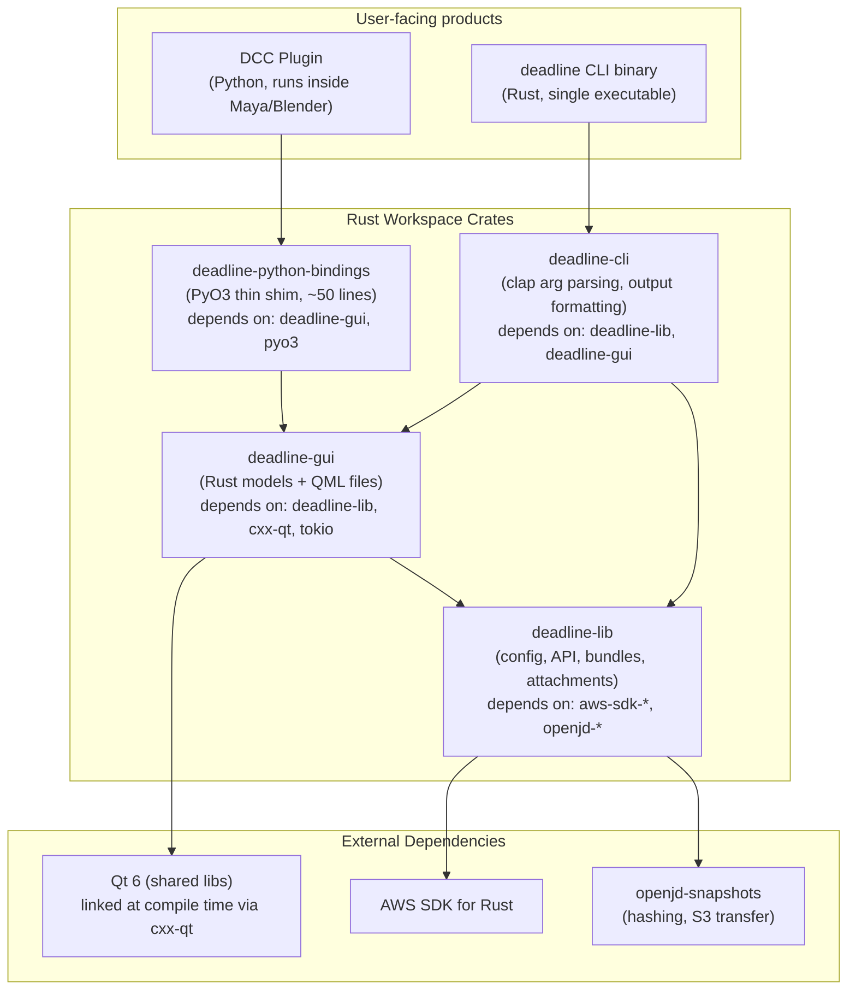
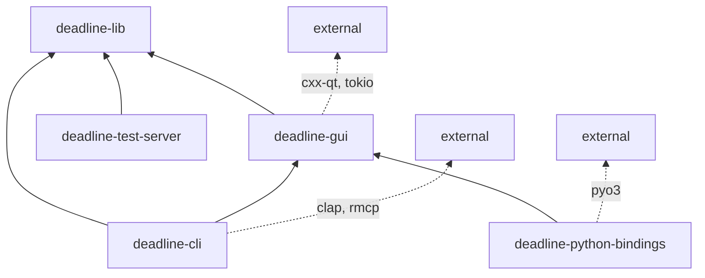

# GUI Rewrite: Pure Rust + QML via cxx-qt

## Goal

Eliminate all Python from the `deadline` product. The GUI becomes pure
Rust (business logic) + QML (declarative UI) via the `cxx-qt` crate (KDAB).
No Python runtime ships with the CLI or installer.

DCC submitter plugins (Maya, Blender, etc.) call into the same Rust GUI
crate via a minimal PyO3 shim — they don't ship Python GUI code either.

## Technology: cxx-qt

- **Repo:** https://github.com/KDAB/cxx-qt (cloned at `../cxx-qt/`)
- **Version:** 0.8.1 (crates.io)
- **License:** MIT OR Apache-2.0
- **Platforms:** macOS arm64 ✅, Linux x86_64 ✅, Windows x64 ✅, WebAssembly
- **Qt versions:** Qt 5.15 LTS, all Qt 6
- **Build:** Pure Cargo (no CMake required)
- **Prerequisite:** Qt 6 installed, `QMAKE` env var pointing to `qmake`

## Spike Results (2026-05-20) ✅

**Proven on macOS arm64 with Qt 6.11.1 (homebrew):**
- cxx-qt v0.8.1 builds and links against system Qt
- QObject model with `#[qproperty]`, `#[qinvokable]`, `Threading` compiles
- QML dialog renders and displays on screen
- `deadline-lib` config integration works (reads settings from INI)
- Existing 1,149 tests unaffected (zero failures)
- Build command: `QMAKE=/opt/homebrew/opt/qt/bin/qmake cargo build -p deadline-gui`

**Skeleton already in place:** `crates/deadline-gui/` with `ConfigModel`,
`ConfigDialog.qml`, and `build.rs` — ready for full implementation.

## Final Architecture



### Key Relationships Explained

1. **`deadline-cli` depends on `deadline-gui`** — When the user runs
   `deadline bundle gui-submit` or `deadline config gui`, the CLI calls
   `deadline_gui::show_submit_dialog()` or `deadline_gui::show_config_dialog()`
   directly. No subprocess, no IPC.

2. **`deadline-gui` depends on `deadline-lib`** — The GUI models call
   library functions for all business logic: `list_farms()`, `login()`,
   `create_job_from_job_bundle()`, `read_config()`, etc. The GUI never
   calls AWS APIs directly.

3. **`deadline-cli` also depends on `deadline-lib` directly** — For
   headless commands (`deadline bundle submit`, `deadline auth login`,
   etc.) the CLI calls the library without involving the GUI crate.

4. **`deadline-python-bindings` depends on `deadline-gui`** — DCC plugins
   call `show_submit_dialog()` through PyO3. The binding is a thin wrapper
   that converts Python dicts to Rust types and calls the same GUI code.

5. **`deadline-gui` depends on `cxx-qt` + Qt 6** — The cxx-qt crate
   provides the Rust↔Qt binding layer. Qt 6 shared libraries are linked
   at compile time. QML files are embedded in the binary via `include_bytes!`.

## Crate Dependency Graph (Cargo)



## How Each User Path Works

### CLI Headless Command (`deadline bundle submit`)

```
User runs: deadline bundle submit --job-bundle-dir /path

deadline-cli:
  1. Clap parses args
  2. Reads config via deadline_lib::config
  3. Calls deadline_lib::bundle::create_job_from_job_bundle()
  4. Prints result

No GUI involved. Pure Rust, single process.
```

### CLI GUI Command (`deadline bundle gui-submit`)

```
User runs: deadline bundle gui-submit --job-bundle-dir /path

deadline-cli:
  1. Clap parses args, reads config
  2. Calls deadline_gui::show_submit_dialog(params)

deadline-gui:
  3. Creates QApp (Qt event loop)
  4. Registers Rust model structs with QML engine
  5. Loads SubmitDialog.qml (embedded in binary)
  6. QML renders the dialog, user interacts
  7. User clicks Submit → QML calls Rust slot
  8. Rust model spawns tokio task:
     - Calls deadline_lib::bundle::create_job_from_job_bundle()
     - Reports progress back to QML via QmlMethodInvoker
  9. Returns job_id to CLI

deadline-cli:
  10. Prints result

Single process. No Python. No subprocess.
```

### DCC Plugin (`Maya submitter`)

```
Maya Python plugin:
  1. Introspects scene (maya.cmds) → builds params dict
  2. from deadline._native import show_submit_dialog
  3. result = show_submit_dialog(params)

deadline-python-bindings (PyO3):
  4. Converts Python dict → Rust SubmitParams struct
  5. Calls deadline_gui::show_submit_dialog(params)

deadline-gui:
  6. Uses Maya's existing QApplication (already running)
  7. Creates a new top-level QML window (SubmitDialog)
  8. User interacts, submits
  9. Returns result

deadline-python-bindings:
  10. Converts Rust result → Python dict
  11. Returns to Maya plugin

Maya plugin:
  12. Shows success message in Maya UI
```

### Config GUI (`deadline config gui`)

```
User runs: deadline config gui

deadline-cli → deadline_gui::show_config_dialog()

deadline-gui:
  1. Creates QApp
  2. Loads ConfigDialog.qml
  3. ConfigModel reads settings via deadline_lib::config
  4. AuthModel checks credentials via deadline_lib::api::session
  5. ResourceModel loads farms/queues via deadline_lib (async, tokio)
  6. User edits settings
  7. Apply → ConfigModel writes via deadline_lib::config
  8. Dialog closes

Returns to CLI.
```

## Internal Structure of `deadline-gui`

```
crates/deadline-gui/
├── Cargo.toml
├── src/
│   ├── lib.rs                 # Public API: show_submit_dialog(), show_config_dialog()
│   ├── app.rs                 # QApp creation, QML engine setup
│   ├── models/
│   │   ├── mod.rs
│   │   ├── auth.rs            # AuthModel — creds source, auth status, API availability
│   │   ├── config.rs          # ConfigModel — settings form state, apply/cancel
│   │   ├── resources.rs       # ResourceModel — farms, queues, storage profiles (QListModel)
│   │   ├── submit.rs          # SubmitModel — job settings, parameters, attachments
│   │   ├── progress.rs        # ProgressModel — hashing/upload progress, log messages
│   │   └── parameters.rs      # ParameterListModel — dynamic form from queue params
│   └── util.rs                # Shared helpers (tokio runtime, error formatting)
└── qml/
    ├── ConfigDialog.qml       # Workstation configuration window
    ├── SubmitDialog.qml       # Job submission window with tabs
    ├── ProgressDialog.qml     # Submission progress (bars, log, cancel)
    ├── LoginDialog.qml        # SSO login flow
    ├── components/
    │   ├── AuthStatusBar.qml  # Login/logout/profile switch strip
    │   ├── FarmSelector.qml   # Farm combo box with async loading
    │   ├── QueueSelector.qml  # Queue combo box with async loading
    │   ├── ParameterForm.qml  # Dynamic parameter inputs from job template
    │   ├── AttachmentList.qml # Input/output file list with add/remove
    │   ├── HostRequirements.qml
    │   └── WarningDialog.qml  # Confirmation for large uploads
    └── style/
        └── Theme.qml          # Colors, fonts, spacing constants
```

## Async Pattern (tokio ↔ Qt)

cxx-qt provides `impl cxx_qt::Threading` which gives access to
`self.qt_thread()` — a `Send` handle that can queue closures to run
on the Qt main thread from any background thread.

```rust
// In the bridge module:
impl cxx_qt::Threading for ResourceModel {}

// In the implementation:
impl qobject::ResourceModel {
    #[qinvokable]
    fn refresh_farms(self: Pin<&mut Self>) {
        let qt_thread = self.qt_thread();
        let profile = self.profile().to_string();

        std::thread::spawn(move || {
            let rt = tokio::runtime::Runtime::new().unwrap();
            let result = rt.block_on(async {
                deadline_lib::api::resources::list_farms(Some(&profile)).await
            });

            // Queue update on Qt main thread
            qt_thread.queue(move |mut obj| {
                match result {
                    Ok(farms) => obj.as_mut().set_farms(farms),
                    Err(e) => obj.as_mut().set_error(e.to_string()),
                }
            }).unwrap();
        });
    }
}
```

QML side:
```qml
ComboBox {
    model: resourceModel.farmNames
    enabled: !resourceModel.farmsLoading
    onActivated: resourceModel.selectFarm(currentIndex)
}
```

## What Gets Deleted

| Item | Lines | Fate |
|------|-------|------|
| `gui/deadline/client/ui/` | ~3000 | Replaced by `crates/deadline-gui/` |
| `gui/deadline/client/config/` | ~200 | Deleted (Rust handles config) |
| `gui/deadline/client/job_bundle/` | ~1500 | Deleted (Rust handles bundles) |
| `gui/deadline/client/_compat.py` | ~90 | Deleted (native Rust enums) |
| `gui/deadline/client/exceptions.py` | ~40 | Deleted |
| `gui/deadline/client/dataclasses/` | ~100 | Deleted (Rust structs) |
| `gui/deadline/client/api/` | ~50 | Deleted |
| `gui/tests/` | ~2000 | Replaced by L1 Rust model tests + L2 `xa11y` accessibility tests |
| `gui/deadline/client/ui/translations/` | ~12 files | Converted to Qt `.ts` format |
| `pyproject.toml` (maturin GUI config) | — | Simplified (DCC shim only) |

**Total Python deleted:** ~7000 lines
**Total Rust+QML added:** ~3000 lines (estimated)

## What Ships to Customers

### Installer (main product)

```
DeadlineClient/
├── deadline              # Rust binary (CLI + GUI)
├── libQt6Core.so        # Qt 6 shared libs (or framework on macOS)
├── libQt6Quick.so
├── libQt6Qml.so
└── (platform libs)
```

No Python. No PySide6. No pip. No venv.

### DCC Submitter Packages (separate distribution)

```
deadline-cloud-for-maya/
├── deadline_submitter/
│   ├── __init__.py           # Maya plugin entry point
│   ├── scene_settings.py     # Maya-specific scene introspection
│   └── ...
└── deadline/
    └── _native.abi3.so       # PyO3 shim → calls Rust GUI
```

The `.abi3.so` is the only compiled artifact. It contains the full
`deadline-gui` + `deadline-lib` linked in. DCC plugins call one function
and get the full GUI experience.

## Migration Phases

### Phase 1: Config Dialog (Spike)
- Create `crates/deadline-gui/`
- Implement `ConfigModel` + `ConfigDialog.qml`
- Wire `deadline config gui` to call Rust GUI directly
- Prove: builds on macOS arm64, tokio works, dialog renders

### Phase 2: Submit Dialog
- Implement `SubmitModel` + `SubmitDialog.qml`
- Implement `ProgressModel` + `ProgressDialog.qml`
- Wire `deadline bundle gui-submit` to call Rust GUI directly
- Prove: full submission flow works end-to-end

### Phase 3: DCC Integration
- Update `deadline-python-bindings` to expose `show_submit_dialog()`
- Test in Maya: plugin calls PyO3 → Rust GUI window appears
- Prove: works inside DCC's existing QApplication

### Phase 4: Cleanup
- Delete `gui/` directory entirely
- Remove PySide6/qtpy/PyYAML dependencies
- Simplify `pyproject.toml` (DCC shim only)
- Update installer pipeline (#26)

## Risks

| Risk | Mitigation |
|------|-----------|
| cxx-qt API changes (pre-1.0) | Pin to v0.8.x; KDAB maintains backward compat |
| Qt 6 version mismatch with DCCs | Build against Qt 6.5 (Maya's version); test ABI compat |
| QML learning curve for team | QML is simpler than Python Qt Widgets; examples provided |
| DCC's QApplication ownership | Rust GUI creates window within existing app (Phase 3 validates) |
| Qt 6 shared lib size (~30MB) | Same as PySide6 was shipping; actually smaller total |
| License (MIT/Apache-2.0 for cxx-qt) | Fully compatible with our Apache-2.0 |
