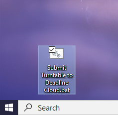
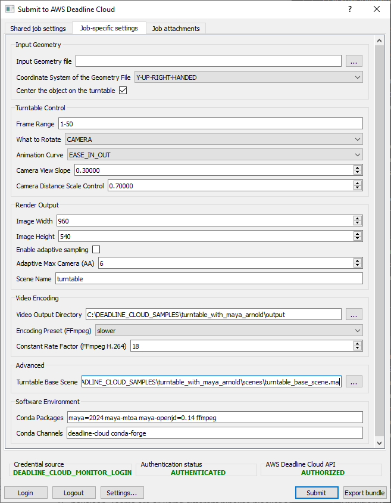
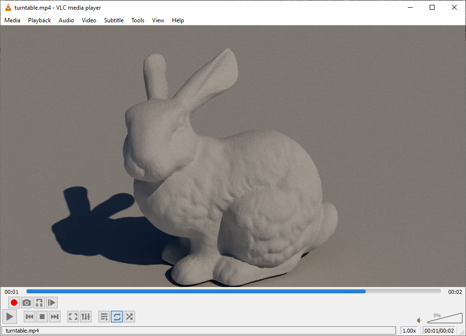

# Turntable with Maya/Arnold job bundle

## Introduction

This job takes an OBJ geometry file as input, and outputs a video turntable render.
A turntable render is a 360 degree rotation of a rendered 3D model that allows inspection
of the geometry without a 3D viewer.

## Pipeline utility jobs

This sample demonstrates how someone comfortable with YAML and scripting in a digital
content creation (DCC) application can create utility jobs that are easy to submit from a GUI.
Read the [Build a job](https://docs.aws.amazon.com/deadline-cloud/latest/developerguide/building-jobs.html)
Deadline Cloud developer guide section to learn more details of the features this job bundle uses:

* The job template defines a pipeline of three steps connected with a dependency chain:
    * Preparing the scene runs as a one-step task with a MayaPy script loading a base Maya scene,
      importing the input geometry file, and adjusting scene properties.
    * Rendering the image sequence runs a separate task per frame, so it can run on many worker hosts.
    * Encoding the video runs as a one-step task by calling FFmpeg.
* The job bundle embeds a base Maya scene file with a camera, lighting, and default geometry.
  It could also embed a selection of HDR environment files, alternative base scene files to handle
  different scenarios, and more. It's often more efficient to mix code with assets generated from a DCC
  application instead of defining everything through code.
* It provides job parameters that can be used for either GUI submission or from automation scripting.
    * By filling in user interface metadata, such as human-readable labels and grouping, running
      `deadline bundle gui-submit turntable_with_maya_arnold` provides a friendly interface to pick
      the input geometry OBJ file and customize the turntable.
    * For automation, a script can submit the job and customize the parameter values with commands
      like `deadline bundle submit turntable_with_maya_arnold -p InputGeometryFile=/path/to/geom.obj ...`.
* It specifies the job's file data flow by using PATH parameters and dependencies between steps. This way
  the job works on farms that use shared file systems or farms that explicitly manage the file data flow
  from task to task, such as in Deadline Cloud's job attachments.
* It specifies conda channel and package parameter values that a
  [Deadline Cloud queue environment](https://docs.aws.amazon.com/deadline-cloud/latest/developerguide/provide-applications.html)
  can use to supply a conda virtual environment for the job. Because of this the job will run
  successfully on a farm created by following
  the [Deadline Cloud default onboarding](https://docs.aws.amazon.com/deadline-cloud/latest/userguide/getting-started.html)

## Example turntable job submission

You can make the job bundle easy to launch by creating a shortcut icon to launch it. On Windows, create
a file on your desktop called `Submit Turntable to Deadline Cloud.bat`, and enter the following content,
substituting your Deadline Cloud CLI installation and where you've placed the job bundle.

```
@call C:\DEADLINE_CLI_INSTALLATION\deadline bundle gui-submit C:\DEADLINE_CLOUD_SAMPLES\turntable_with_maya_arnold
```



Double click the icon to load the GUI submitter for the turntable job bundle. Here is what the
Job-specific settings tab looks like.



If you accept all the default settings, it will render a turntable with simple placeholder geometry.
You can download an OBJ geometry file, such as
[stanford-bunny.obj](https://github.com/alecjacobson/common-3d-test-models/blob/master/data/stanford-bunny.obj),
and select the file for the input geometry file parameter.

Once the job is complete, you can [use Deadline Cloud monitor](https://docs.aws.amazon.com/deadline-cloud/latest/userguide/download-finished-output.html)
to download the result of the EncodeVideo step. Here's a frame of the output of
a [Stanford bunny](https://faculty.cc.gatech.edu/~turk/bunny/bunny.html) turntable.


